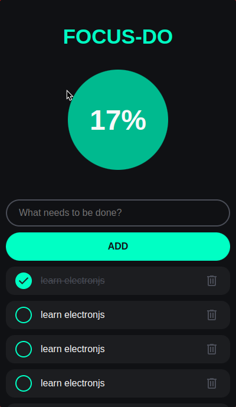
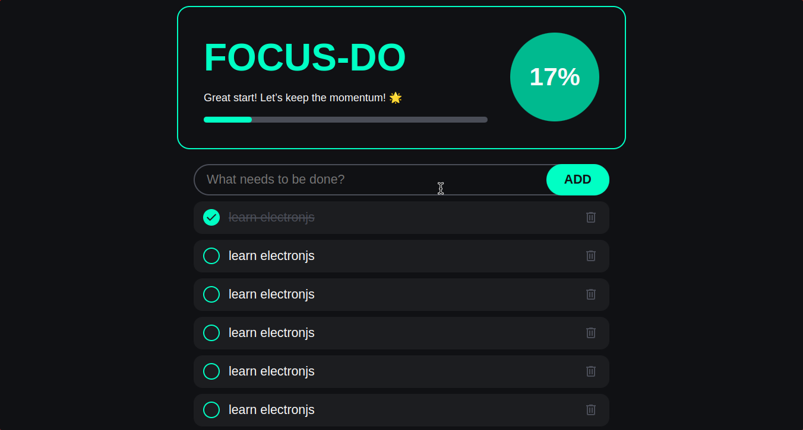

# Focus-Do
**Focus-Do** is a sleek and intuitive desktop To-Do application developed using HTML, CSS, and JavaScript, packaged with ElectronJS to create a seamless user experience. Designed with the goal of fostering discipline and productivity, Focus-Do allows users to easily manage their tasks with a user-friendly interface that prioritizes simplicity and efficiency. With features like task addition, deletion, and progress tracking, users can stay organized and focused on their goals. Whether you’re managing daily tasks or long-term projects, Focus-Do is the perfect companion to help you stay on track and achieve your objectives.




# Build from source
1. Make sure Node.js is installed:
```bash
# On Debian/Ubuntu based distros
sudo apt install nodejs npm

# On RHEL based distros
sudo dnf install nodejs

# On Arch based distros
sudo pacman -S nodejs npm
```

2. Clone the repository:
```bash
git clone https://github.com/xeyossr/Focus-Do
cd Focus-Do
```

3. Install the dependencies:
```bash
npm install
```

4. Compile it:
```bash
npm run build
```

5. Make AppImage file executable:
```bash
chmod +x dist/*
./dist/(app image file)
```